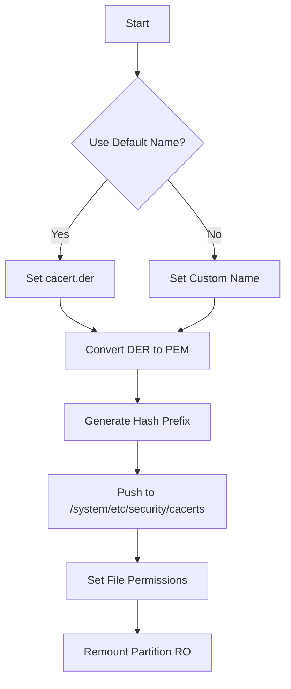

# Shell-for-Android
Shell file for installing the Burpsuite certificate into Android

## Incert-BurpCert - Android Certificate Installer
Automated tool for installing Burp Suite certificate on rooted Android devices

### 📝 Description
Windows batch script that automates:
1. Certificate conversion from DER to PEM format
2. Hash-based renaming for Android system recognition
3. ADB push to system certificate directory
4. Permission setting and partition remount
---
### 🛠️ Prerequisites
- ✔️ Rooted Android device with USB debugging enabled
- ✔️ adb configured in system PATH 🔗 [ADB installation guide](https://developer.android.com/studio/command-line/adb)
  - [Download Link](https://developer.android.com/tools/releases/platform-tools?hl=ko)
- ✔️ openssl installed and accessible
- ✔️ Burp Suite CA certificate exported as .der file
  - Default name: cacert.der
  - Custom name: Must match user input
---
### 🚀 Usage
```bash
1. Export Burp Certificate:
   - Burp Suite → Proxy → Options → Export CA certificate → DER format

2. Place certificate in script directory

3. Run script:
   Incert-BurpCert.bat

4. Follow prompts:
   [Y] for custom name (e.g.: myburpca)
   [N] for default name (cacert)
```
---
### ⚙️ Technical Process

---
### 📌 Important Notes
- 🔄 System Partition Requirement:   
Requires write access to /system partition. If using Magisk:
```bash
adb shell magisk --mount-master
```
-⚠️ Certificate Validation:   
After installation, verify in:   
Settings → Security → Trusted Credentials → PortSwigger CA   

-🛡️ Safety Measures:
Script includes automatic:   
- adb root authentication   
- Partition remount protection   
- File ownership verification (chmod 644)
---
### ❓ Troubleshooting
|Error|Solution|
|------|---|
|adb: command not found|Add platform-tools to PATH|
|openssl not recognized|Install OpenSSL v3.0+|
|Permission denied|Enable root access in dev options|
|Certificate not showing|Check hash prefix match|
---
### 📜 License
MIT License - Kai_HT © 2024   
_"Incert-BurpCert is provided as-is - use responsibly!"_
```text
+ Successfully installed certificate when script completes without errors
- Cancel operation if any red error messages appear
```
Last updated: 2024-02-25 (v1.0)
